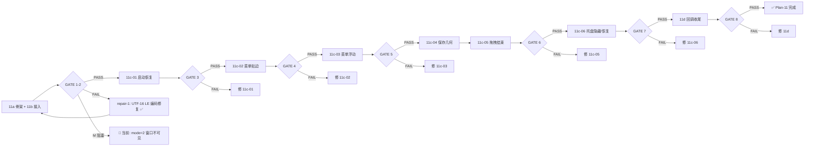

# Plan-11 — 测试进度追踪

## 执行流水线



## GATE 状态表

| GATE | 子阶段文件 | 验证项 | 门控规则 | 状态 | 执行记录 |
|------|-----------|--------|---------|:----:|---------|
| 1-2 | `plan-11a-config-skeleton_done.md#测试用例` + `plan-11b-ini2arr-wiring_done.md#测试用例` | 3 [A] + 3 [M] | 全部通过 | 🔴 阻塞（repair-2 待确认） | [A] 2026-06-05 3/3 PASS ✅<br>[M] M-1: mode 不再被覆盖 ✅<br>[M] M-1: 窗口不可见 → 根因: state.ini dock_edge=0 dock_thickness=0 导致 width=0 🔍<br>[M] M-2: 待执行<br>[M] M-3: 待执行 |
| 3 | `plan-11c-01-startup-restore_done.md#测试用例` | 2 [A] + 3 [M] | [A] 全部 + [M] 全部 | ⏳ 阻塞（GATE 1-2） | [A] 2026-06-05 通过 ✅ |
| 4 | `plan-11c-02-menu-edge-reserved_done.md#测试用例` | 1 [A] + 2 [M] | 全部通过 | ⏳ 阻塞（GATE 1-2） | 未执行 |
| 5 | `plan-11c-03-menu-floating_done.md#测试用例` | 1 [A] + 2 [M] | 全部通过 | ⏳ 阻塞（GATE 1-2） | 未执行 |
| 6 | `plan-11c-05-drag-end_done.md#测试用例` | 1 [A] + 2 [M] | 全部通过 | ⏳ 阻塞（GATE 1-2） | 未执行 |
| 7 | `plan-11c-06-tray-hide-restore_done.md#测试用例` | 1 [A] + 2 [M] | 全部通过 | ⏳ 阻塞（GATE 1-2） | 未执行 |
| 8 | `plan-11d-callbacks-cleanup_done.md#测试用例` | 6 [A] + 3 [M] | 全部通过 | ⏳ 阻塞（GATE 1-2） | 未执行 |

## 执行规则

| 角色 | 职责 |
|:----:|------|
| [agent] | 运行自动化检查（`## 测试用例` 中标注 [A] 的项），更新执行记录 |
| [human] | 执行手工验证（`## 测试用例` 中标注 [M] 的项），反馈结果给 agent |
| 交接点 | GATE 通过条件中 [agent] 和 [human] 两部分都满足后，agent 解锁下一 GATE |

## 修复记录

### 2026-06-05 — repair-1: UTF-16 LE 编码不兼容 ✅ 已修复

**根因**：`StateStore` 以 UTF-16 LE with BOM 写入 `state.ini`，但 `ini2arr.c` 用 `fopen("r")` 按 ASCII 解析。UTF-16 中每个 ASCII 字符后跟 `\0` 空字节，C 字符串在第一个 `\0` 处截断 → 所有 key=value 解析失败 → `Config_Get` 全部返回默认值 0。首次 `Config_Set` 调用时以 ASCII 写回，原 UTF-16 内容被破坏。

**修复**：`src/utils/ini2arr.c` 新增 `read_file_ascii()` 函数，用 `fopen("rb")` 二进制读，检测 BOM `FF FE`，自动将 UTF-16 LE 转为 ASCII（丢弃奇数位高字节）。`ini2arr()` 和 `ini2arr_write()` 均改用该函数。写入始终 ASCII，实现一次性格式迁移。

**涉及文件**：`src/utils/ini2arr.c`

**测试**：`test_ini2arr` 4/4 PASS ✅ / UTF-16 LE 读写+写回 PASS ✅ / 主项目编译通过 ✅

**手工验证**：启动/关闭后 `shell_resident_mode` 不再被覆盖 ✅

### 2026-06-05 — 🔴 当前阻塞：repair-2 — dock 参数为 0 导致窗口宽度=0

**根因**：上一步 UTF-16 修复后 Config 正确读到 `dock_edge=0``dock_thickness=0`（此前 Config bug 残留在 state.ini 中），`AppBar_SetPosition(hwnd, 0, 0)` 设置宽度=0，窗口不可见。

**代码修复**：`src/app/app.c` 中 `App_TryRegisterAppBarFromState` 增加参数校验，当 edge 越界或 thickness < 100 时使用默认值（RIGHT/240）。

**待验证**：
- [ ] 编辑 `state.ini` 设 `dock_edge=2` `dock_thickness=240`，启动验证窗口可见
- [ ] 或直接测试代码保护：启动前设 `dock_thickness=0`，确认被自动提升到 240

### 2026-06-05 — repair-3 诊断结论：存在多入口重协商，ReRegister 实现有风险

**结论**：你的判断成立，当前 AppBar 定位/重协商确实存在多个入口，且其中一条链路可能导致保留区被重复扣减。

**入口点（代码）**：
- `src/app/app.c` `App_TryRegisterAppBarFromState()`（启动恢复）
- `src/app/app.c` `OnShellModeChanged()`（配置回调触发）
- `src/platform/win32/window.c` `WM_SETTINGCHANGE/WM_DISPLAYCHANGE/WM_APP+2` → `AppBar_ReRegister()`（系统事件重协商）

**关键风险点**：`src/platform/win32/appbar.c` `AppBar_ReRegister()` 里直接 `s_appbar.registered = 0; AppBar_Register()`，没有先 `ABM_REMOVE` 旧注册，可能形成“旧保留区未释放 + 新保留区再申请”的状态。

**与截图现象一致性**：黑色最大化窗口与黄色 DeskNote 之间出现一条独立红色 gap，符合“工作区被额外扣减一段，但窗口未占用该段”的表现。

**已实施修复（repair-3）**：
- `AppBar_ReRegister()`：改为先 `AppBar_Unregister()` 再 `AppBar_Register()+SetPosition()`
- own-workarea 标记：布尔改计数器，避免多条消息漏消费
- `AppBar_Unregister()`：移除“先挪到底部再 REMOVE”逻辑，直接 `ABM_REMOVE`
- `WM_SETTINGCHANGE(SPI_SETWORKAREA)`：不再对“已注册且稳定”的 AppBar 做二次 ReRegister，避免重复协商导致二次扣减

### 2026-06-05 — A-2 冷启动浮动坐标 (0,0) 修复（已归档）

**根因**：`Config_Init("state.ini")` 使用相对路径，与 StateStore 路径不一致。

**修复**：`src/app/app.c` 改用 `StateStore_GetStatePath`。

**涉及文件**：`src/app/app.c`

## 依赖关系

```
11a+11b → 11c-01 → 11c-02 → 11c-03 → 11c-04 → 11c-05 → 11c-06 → 11d
```

每个 GATE 前置依赖必须通过。11c-04 无独立测试，由 11c-02 + 11c-05 交叉覆盖。
