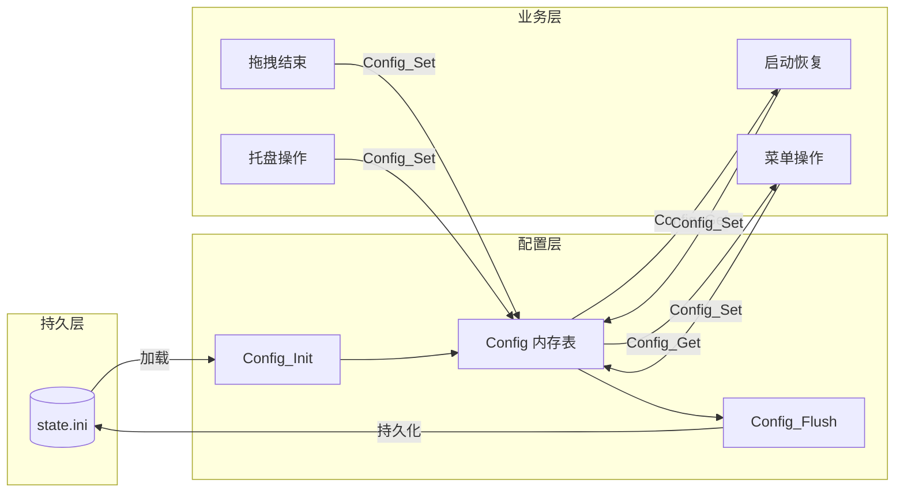

# Plan-11c — 迁移写入点

## 核心问题
`app.c` 中全部 `StateStore_Load` / `StateStore_Save` 调用分散在 6 个入口场景，配置读写路径不统一，无法通过 Config 层统一管理持久化。

## 子计划

| 编号 | 子计划文件 | 覆盖内容 |
|------|-----------|---------|
| 11c-01 | `plan-11c-01-startup-restore.md` | 启动时贴边/浮动恢复 + titlebar_height 读路径 |
| 11c-02 | `plan-11c-02-menu-edge-reserved.md` | 菜单进入/退出贴边模式 |
| 11c-03 | `plan-11c-03-menu-floating.md` | 菜单浮动置顶保存几何 |
| 11c-04 | `plan-11c-04-cmd103-save-geom.md` | cmd103 进入贴边前保存浮动几何 |
| 11c-05 | `plan-11c-05-drag-end.md` | 拖拽结束→浮动/普通 |
| 11c-06 | `plan-11c-06-tray-hide-restore.md` | 托盘隐藏/恢复 |

## 方案选型

只有一条可行路径：用 Config_Get/Set 直接替换 StateStore 读/写。不引入中间层，不 cache 到新结构。

## 接入点

全部子计划执行完成后，`app.c` 中 `StateStore_Save` 仅剩 `App_SaveCurrentDocument` 中的文档字段一行。

## 前置

- Config_Init 已在 App_Init 入口调用
- config.h 中所有键宏已定义

## 主链路

## 分层核实

- 所有替换为 Config_Get / Config_Set，不调 StateStore（除文档管理字段）
- 本子计划不修改：src/render/*、src/editor/*、src/core/*、src/ui/*、src/platform/*

## 风险

- 如果某一步替换引入 bug，后续步骤会累积错误。每个步骤独立验证后再继续下一组。
- 如需要回退某个步骤：手动恢复前后对比的代码段即可（每组步骤都给出了"原代码"和"改为"两段）
