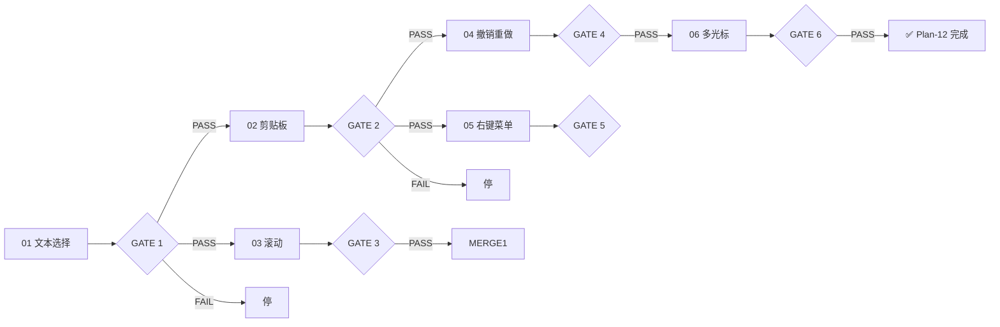

# Plan-12 — 编辑器功能增强

## 架构

编辑器扩展在现有 editor→render→app 分层上叠加：

```
App_OnKeyDown / App_OnLeftButtonDown
    │
    ├── Ctrl+C/V/X → Clipboard API（app 层）
    ├── Ctrl+Z/Y   → Editor UndoStack（editor 层）
    ├── Delete     → Editor_HandleKey（editor 层）
    ├── Ctrl+点击   → Editor_AddCursor（editor 层）
    └── 右键菜单    → TrackPopupMenu（app 层）
```

## 子阶段划分

| 子阶段 | 文件 | 功能 | 状态 | 依赖 | GATE |
|--------|------|------|------|------|------|
| 01 | `plan-12-editor-01-text-selection_debug_record.md` | 文本选择 + 单击清除 | ✅ 已完成 | 无 | GATE 1 |
| 02 | `plan-12-editor-02-clipboard.md` | Ctrl+C/V/X + Delete | ⏳ 待实施 | 01 | GATE 2 |
| 03 | `plan-12-editor-03-scroll.md` | 平滑滚动 + 横向滚动 | ⏳ 待实施 | 01 | GATE 3 |
| 04 | `plan-12-editor-04-undo-redo.md` | Ctrl+Z/Y 撤销重做 | ⏳ 待实施 | 02 | GATE 4 |
| 05 | `plan-12-editor-05-context-menu.md` | 右键剪切/复制/粘贴 | ⏳ 阻塞（依赖 02） | 02 | GATE 5 |
| 06 | `plan-12-editor-06-multi-cursor.md` | Ctrl+点击多光标 | ⏳ 阻塞（依赖 04） | 04 | GATE 6 |

## GATE 依赖



## 推荐实施顺序

```
第1步: 02-clipboard (与 03 可并行)         ← 当前切入点
第2步: 03-scroll (与 02 可并行)
  ↓
第3步: 04-undo-redo (依赖 02)
第4步: 05-context-menu (依赖 02)
  ↓
第5步: 06-multi-cursor (依赖 04)
```
