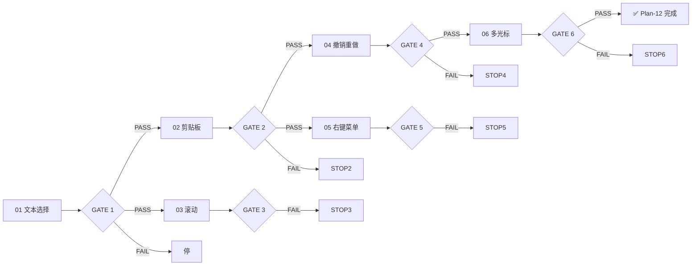

# Plan-12 — 测试进度追踪

## GATE 依赖图

## GATE 状态表

| GATE | 子阶段 | 验证项 | 门控规则 | 状态 |
|------|--------|--------|---------|------|
| 1 | `plan-12-editor-01-text-selection_debug_record.md#验收标准` | 1 [A] + 2 [M] | 全部通过 | ✅ 已完成 |
| 2 | `plan-12-editor-02-clipboard.md#验收标准` | 5 [A] + 3 [M] | 全部通过 | ⏳ 待实施 |
| 3 | `plan-12-editor-03-scroll.md#验收标准` | 3 [A] + 5 [M] | 全部通过 | ⏳ 待实施 |
| 4 | `plan-12-editor-04-undo-redo.md#验收标准` | 3 [A] + 4 [M] | 全部通过 | ⏳ 待实施 |
| 5 | `plan-12-editor-05-context-menu.md#验收标准` | 3 [A] + 5 [M] | 全部通过 | ⏳ 待实施 |
| 6 | `plan-12-editor-06-multi-cursor.md#验收标准` | 3 [A] + 5 [M] | 全部通过 | ⏳ 待实施 |

## 执行规则

| 角色 | 职责 |
|:----:|------|
| [agent] | 运行自动化检查（`## 测试用例` 中标注 [A] 的项），更新执行记录 |
| [human] | 执行手工验证（`## 测试用例` 中标注 [M] 的项），反馈结果给 agent |
| 交接点 | GATE 通过条件中 [agent] 和 [human] 两部分都满足后，agent 解锁下一 GATE |

## 依赖规则

- GATE 1 是基础依赖，必须先通过
- GATE 2 和 GATE 3 可并行实施
- GATE 4 和 GATE 5 依赖 GATE 2
- GATE 6 依赖 GATE 4
- 上游 GATE 未通过 → 下游跳过

## 当前状态

所有子阶段已完成设计，等待实施。推荐从 GATE 2（剪贴板）和 GATE 3（滚动）并行切入。
