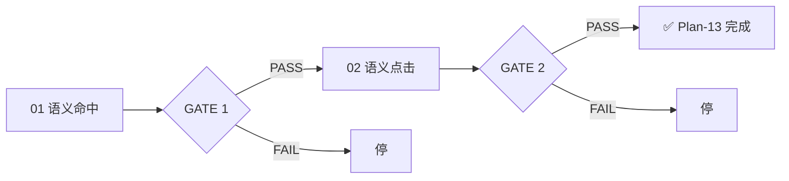

# Plan-13 — Markdown 语义交互

## 架构

通过 md4c 解析器产出的 Markdown AST 与 editor/core 分层结合：

```
lib/md4c
  │
  ├── md4c_parse() → Markdown AST
  │
core/document
  │
  ├── Document_GetSemanticAt(offset) → MdSemanticInfo
  │
render
  │
  ├── Render_HitTestPoint → 同时输出 offset + MdSemanticInfo
  │
app
  │
  ├── App_OnLeftButtonDown → 根据 MdHitType 分派
  │   ├── MD_HIT_LINK     → ShellExecuteW 打开浏览器
  │   ├── MD_HIT_CHECKBOX → Editor_ReplaceTextInRange 切换 [ ]/[x]
  │   └── MD_HIT_NONE     → 默认点击定位
```

## 子阶段划分

| 子阶段 | 文件 | 功能 | 状态 | 依赖 | GATE |
|--------|------|------|------|------|------|
| 01 | hit-test | 语义命中识别 | ⏳ 阻塞 | Plan-12 完成 + md4c 接入 | GATE 1 |
| 02 | semantic-click | 语义点击行为 | ⏳ 阻塞 | 01 | GATE 2 |

## GATE 依赖



## 推荐实施顺序

```
先完成 Plan-12 编辑器功能 → 再接入 lib/md4c → 01 hit-test → 02 semantic-click
```

## 前置依赖

- 需要先重新接入 `lib/md4c` 解析器（已在子模块中）
- 需要 Plan-12 编辑器功能完成（选区、剪贴板等作为基础）
- `core/document` 层需增加 AST 存储结构
