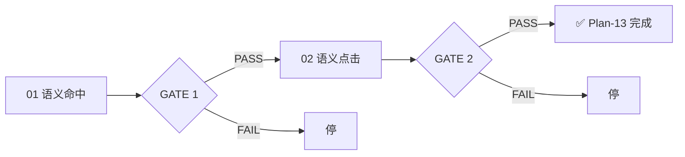

# Plan-13 — 测试进度追踪

## GATE 依赖图

## GATE 状态表

| GATE | 子阶段 | 验证项 | 门控规则 | 状态 |
|------|--------|--------|---------|------|
| 1 | `plan-13-markdown-01-hit-test.md#验收标准` | 5 [A] + 3 [M] | 全部通过 | ⏳ 阻塞（需先接入 md4c） |
| 2 | `plan-13-markdown-02-semantic-click.md#验收标准` | 4 [A] + 4 [M] | 全部通过 | ⏳ 阻塞（依赖 GATE 1） |

## 执行规则

| 角色 | 职责 |
|:----:|------|
| [agent] | 运行自动化检查（`## 测试用例` 中标注 [A] 的项），更新执行记录 |
| [human] | 执行手工验证（`## 测试用例` 中标注 [M] 的项），反馈结果给 agent |
| 交接点 | GATE 通过条件中 [agent] 和 [human] 两部分都满足后，agent 解锁下一 GATE |

## 依赖规则

- GATE 1 是基础依赖，必须先通过
- GATE 2 依赖 GATE 1

## 前置阻塞

- 需要先完成 Plan-12 编辑器功能
- 需要先接入 lib/md4c 解析器
